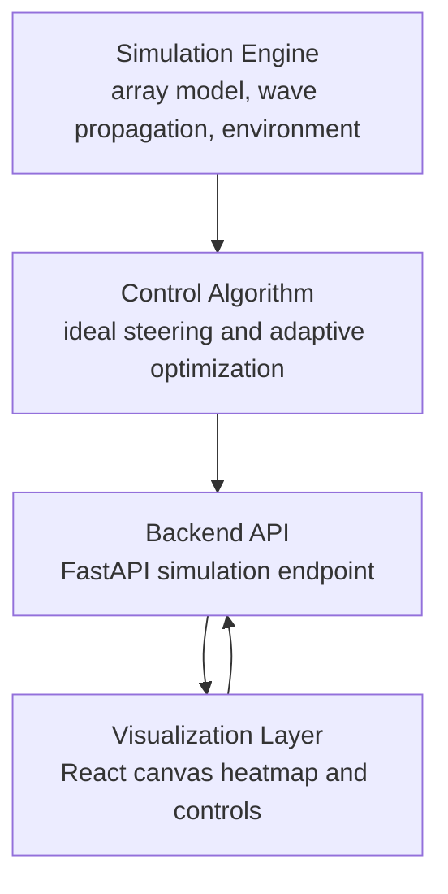

# System Architecture

## Responsibilities

The simulation engine models the antenna positions, scalar wave propagation, received power, external interference, noise, and obstacle attenuation.

The control algorithm starts with analytic phase alignment toward the receiver, then perturbs phase groups to maximize measured received power when the environment is imperfect.

The backend exposes a compact JSON snapshot for each frame of the simulation.

The frontend renders the heatmap, antennas, receiver, obstacles, and metrics while allowing manual receiver movement.

